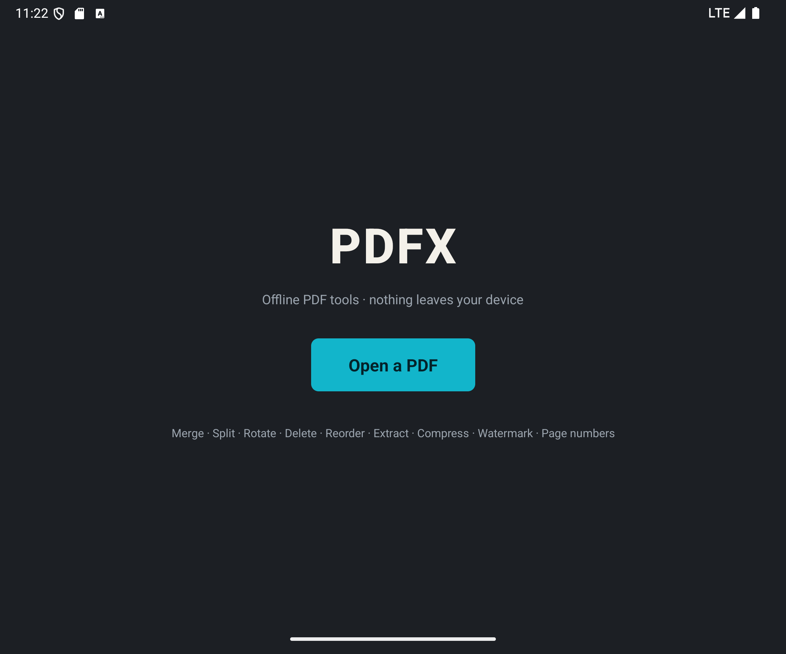
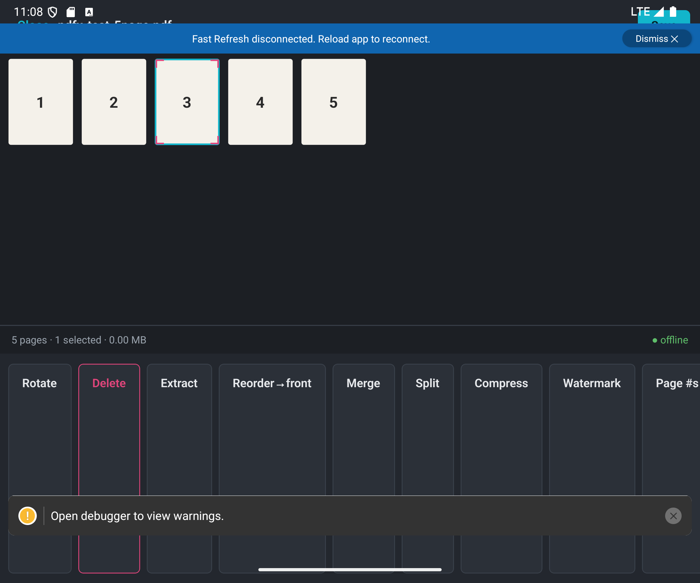

# PDFX — offline-first PDF editor

[](https://github.com/pachisiav11/pdf-handling/actions/workflows/ci.yml)

Fast, private, fully-offline PDF editing for desktop and Android, built from one shared TypeScript core. **No uploads, no accounts, no telemetry, no paywall.** Everything runs on your machine — the competitive angle against tools like iLovePDF is that there is no upload/download round-trip and nothing ever leaves your device.

**Download:** grab the Windows installer and the Android APK from the [v1.0 release](https://github.com/pachisiav11/pdf-handling/releases/tag/v1.0.0).

## Screenshots

Desktop (Electron) — the prepress light-table: graphite desk, paper-white page thumbnails, CMYK ink accents, registration crop-marks as the selection state.

Android — the same identity, running the shared core in Hermes:

| Home | Page grid + tools |
|---|---|
|  |  |

## Why it's different from iLovePDF & friends

| | iLovePDF (web) | PDFX |
|---|---|---|
| Where files go | Uploaded to a server | Never leave your machine |
| Works offline | No | Yes — every core tool |
| Speed | Upload → process → download | Instant, local (≤1s on typical docs) |
| Accounts / paywall | Yes for many tools | None |
| Telemetry | Yes | None (errors log to a local file only) |

## Features

**Core** — merge, split (by range or into individual pages), delete/extract/reorder pages, rotate, compress (3 presets), view with zoom.
**Editing** — text overlay, highlight/underline/strikethrough, freehand draw, image stamps, page numbers, watermark, crop, and **true redaction** (the page is rasterized and the original content stream is discarded — the removed text cannot be recovered, unlike a cosmetic black box).
**Forms & signatures** — detect & fill AcroForm fields, create text-field/checkbox fields, and sign or initial by drawing, typing (handwriting font), or uploading an image (saved locally for reuse).
**Conversion** — images ↔ PDF, PDF → images (PNG), PDF → text, OCR of scanned PDFs (Tesseract, English bundled), and **Office → PDF** (Word/Excel/PowerPoint, desktop-only via bundled LibreOffice).

**Android** — the mobile app runs the shared core in Hermes and covers the page toolset: merge, split, delete, extract, reorder, rotate, compress, watermark, page numbers, undo/redo, and save to Downloads. Editing/forms/OCR/conversion and rendered page previews are desktop-only in v1 (see PROGRESS.md → Phase 7 for why, and the v1.1 plan).

See [PROGRESS.md](PROGRESS.md) for exactly what's implemented per phase.

## Repository layout

```
packages/core        @pdfx/core — all PDF logic (pdf-lib, pdf.js, tesseract.js), shared by both apps
packages/ui-components  shared React components (stub; components currently live in the desktop app)
apps/desktop         Electron + React (electron-vite)
apps/mobile          React Native (Android)
scripts/             fetch-binaries.mjs, gen-icon.mjs
```

## Build & run from source

Requires **Node ≥ 20** and **pnpm 9** (`npm i -g pnpm@9`). pnpm 11 has a linking hang on this workspace on Windows — use 9.x.

```sh
pnpm install

# core unit tests (43 tests, includes redaction & OCR acceptance checks)
pnpm --filter @pdfx/core test

# desktop app in dev
pnpm --filter @pdfx/desktop dev
```

### Desktop production build & installer

```sh
node scripts/fetch-binaries.mjs --office   # download offline binaries first (see below)
pnpm --filter @pdfx/desktop build
cd apps/desktop && npx electron-builder --win   # → apps/desktop/release/PDFX-Setup-<version>.exe
```

### Android app (APK)

Requires the **Android SDK** (platform 36, build-tools 36.0.0), **NDK 27.1.12297006**, **CMake 3.22.1**, and **JDK 21**. RN 0.86 is new-architecture-only, so the NDK/CMake are required even though the app ships no C++ of its own.

```sh
# from a fresh checkout, install workspace deps first
pnpm install

# debug build onto a running emulator/device (Metro required):
pnpm --filter @pdfx/mobile start          # terminal 1 — Metro
pnpm --filter @pdfx/mobile android        # terminal 2 — build + install

# self-contained release APK (bundled JS, runs offline, no Metro):
cd apps/mobile/android && ./gradlew assembleRelease
# → apps/mobile/android/app/build/outputs/apk/release/app-release.apk
```

The prebuilt APK is attached to the [v1.0 release](https://github.com/pachisiav11/pdf-handling/releases/tag/v1.0.0) alongside the desktop installer (it is not committed to git). It is signed with the debug keystore — fine for sideloading.

> **pnpm + React Native note:** with pnpm's isolated `node_modules`, RN's Gradle build resolves a few packages by path that would otherwise be hidden in the virtual store. They are declared as direct devDependencies of `@pdfx/mobile` (`@react-native/gradle-plugin`, `@react-native/codegen`, `hermes-compiler`) and `react.hermesCommand` is pointed at the `hermes-compiler` package. This is why the app builds under pnpm without hoisting.

## Continuous integration

`.github/workflows/ci.yml` runs on every push/PR:
- **verify** (Ubuntu) — install, `@pdfx/core` unit tests, typecheck all three packages, the desktop electron-vite bundle, and the mobile Metro bundle. This is the always-on gate.
- **android-apk** (Ubuntu) — installs the SDK/NDK/CMake and produces the release APK as a build artifact.
- **desktop-installer** (Windows) — builds the NSIS installer (without the large LibreOffice payload; the app degrades to a system LibreOffice) and uploads it as an artifact.

## Native binaries (not committed to git)

The large offline helper binaries are **not** stored in this repo (they'd bloat it by well over a gigabyte). Fetch them locally with:

```sh
# Tesseract English OCR data (~4 MB) — always needed for OCR
node scripts/fetch-binaries.mjs

# + LibreOffice (~350 MB download, ~1.6 GB extracted) — needed for Office → PDF
node scripts/fetch-binaries.mjs --office

# + Ghostscript (optional; better High-preset compression)
node scripts/fetch-binaries.mjs --gs
```

They land under `apps/desktop/resources/` (gitignored). electron-builder bundles them into the installer as `extraResources`. **The bundled-LibreOffice installer is ~490 MB** — that's the documented tradeoff for making Office conversion work fully offline. If you skip `--office`, the app falls back to a system-installed LibreOffice if one is present, and clearly reports when conversion is unavailable rather than failing silently.

OCR works with only the small Tesseract step; Office conversion is the only feature that needs the large download.

## Privacy & logging

No network calls in any core tool. Crash/error logging is **local only** — unhandled errors go to a dated log file under the OS log directory (`app.getPath('logs')`), capturing operation type and file metadata but never file contents. There is no remote transport, analytics SDK, or crash reporter.

## License

MIT.
