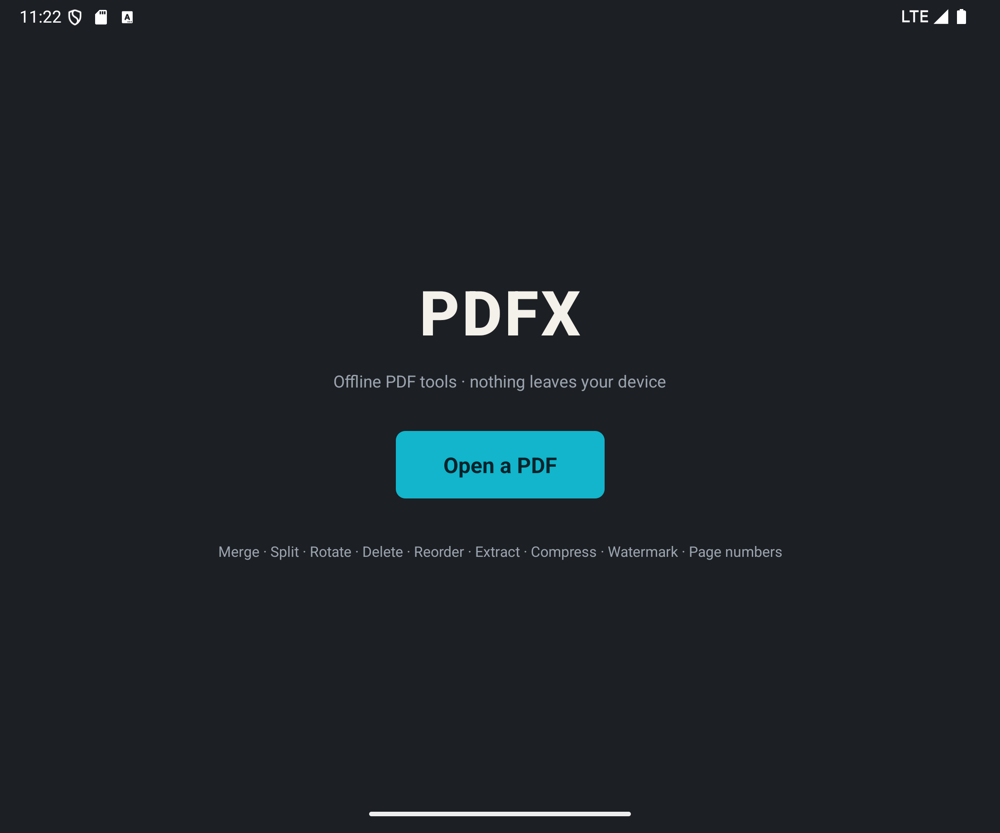
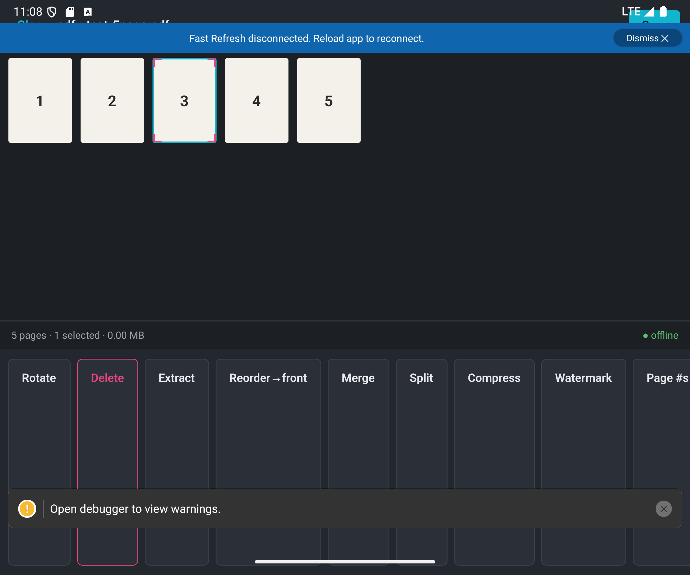

# PDFX — offline PDF editor for desktop and Android

[](https://github.com/pachisiav11/pdf-handling/actions/workflows/ci.yml)

Fast, private, fully-offline PDF editing for Windows and Android, built from one shared TypeScript
core. **No uploads, no accounts, no telemetry.** Every operation runs on your device.

> **History.** For a period in 2026 PDFX sent documents to the iLovePDF REST API for processing.
> v1.2 returns to fully local processing. The API client is kept, unused, in
> `packages/ilovepdf-api` (see its README); nothing in either app imports it.

**Download:** grab the Windows installer and the Android APK from the [latest release](https://github.com/pachisiav11/pdf-handling/releases/latest).

## Screenshots

Desktop (Electron) — the prepress light-table: graphite desk, paper-white page thumbnails, CMYK ink accents, registration crop-marks as the selection state.

Android — the same identity, running the shared core in Hermes:

| Home | Page grid + tools |
|---|---|
|  |  |

## Where your files go

| | PDFX |
|---|---|
| Document processing | On your device only |
| Works offline | Yes — every tool |
| Accounts | None |
| Telemetry | None — errors are written to a local log file only |

## Features

**Core** — merge, split (by range or into individual pages), delete/extract/reorder pages, rotate,
compress (3 presets and target size), view with zoom.
**Editing** — text overlay, highlight/underline/strikethrough, freehand draw, image stamps, page
numbers, watermark, crop, and **true redaction** (the page is rasterized and the original content
stream is discarded).
**Forms & signatures** — detect and fill AcroForm fields, create text-field/checkbox fields, and
sign or initial by drawing, typing, or uploading an image.
**Conversion** — images ↔ PDF, PDF → images, PDF → text, OCR of scanned PDFs (Tesseract, English
bundled), and Office → PDF (desktop only, via bundled LibreOffice).
**Productivity** — command palette (Ctrl+K), batch processing, page-size normalize, title editor,
searchable OCR, and session undo/redo.

**Android** — merge, split, delete, extract, reorder, rotate, compress (presets and target size),
watermark, page numbers, normalize, title, batch (multi-file → Downloads), a long-press per-page
action sheet, undo/redo, and save to Downloads. v1.2 adds a **pdf.js reader** (scroll, pinch zoom)
and **rendered page thumbnails** in the grid. Editing, forms, OCR and conversion are desktop-only.

### Compression

Compression works the same way on both platforms:

| Preset | Images | Everything else |
|---|---|---|
| Low | untouched | lossless re-save; uncompressed streams are deflated |
| Medium | photos re-encoded as JPEG, longest side ≤ 1600 px, quality 0.8 | same as Low |
| High | photos re-encoded as JPEG, longest side ≤ 1000 px, quality 0.6 | same as Low |

Both JPEG and PNG-type (Flate) images are re-encoded. Text and vector art are never rasterized.
Flat graphics (logos, diagrams, screenshots that already compress well), masks, CMYK and other
unusual image layouts stay lossless, and a re-encoded image is only kept when it is smaller. On
Android a small native module (`PdfxNative`) decodes, scales and encodes the images; on desktop
the PDF worker uses the browser's image codecs.

### Open PDFs with PDFX

PDFX registers itself as a PDF handler but never takes over as the default. You choose:

- **Windows** — right-click a PDF → **Open with** → **PDFX**. To make it the default, pick
  "Always use this app", or go to **Settings → Apps → Default apps**, search `.pdf`, and pick
  PDFX. To switch back, choose your previous app in the same place. Opening more PDFs while PDFX
  is running adds them as tabs in the open window.
- **Android** — open a PDF from Files, a browser download, or an email attachment and pick
  **PDFX** in the chooser ("Just once" or "Always"). To switch back, open **Settings → Apps →
  PDFX → Open by default → Clear defaults** (the wording varies by phone), then pick another
  app next time. Files opened this way go straight to the reader; tap **‹ Pages** for the tools.

See [PROGRESS.md](PROGRESS.md) for what was implemented per phase.

## Repository layout

```
packages/core        @pdfx/core — all PDF logic (pdf-lib, pdf.js, tesseract.js), shared by both apps
packages/ui-components  shared React components (stub; components currently live in the desktop app)
apps/desktop         Electron + React (electron-vite)
apps/mobile          React Native (Android)
scripts/             fetch-binaries.mjs, gen-icon.mjs
```

## Build & run from source

Requires **Node ≥ 20** and **pnpm 9** (`npm i -g pnpm@9`). pnpm 11 has a linking hang on this workspace on Windows — use 9.x.

```sh
pnpm install

# core unit tests (64 tests, includes redaction, OCR and compression checks)
pnpm --filter @pdfx/core test

# desktop app in dev
pnpm --filter @pdfx/desktop dev
```

### Desktop production build & installer

```sh
node scripts/fetch-binaries.mjs --office   # download offline binaries first (see below)
pnpm --filter @pdfx/desktop build
cd apps/desktop && npx electron-builder --win   # → apps/desktop/release/PDFX-Setup-<version>.exe
```

### Android app (APK)

Requires the **Android SDK** (platform 36, build-tools 36.0.0), **NDK 27.1.12297006**, **CMake 3.22.1**, and **JDK 21**. RN 0.86 is new-architecture-only, so the NDK/CMake are required. The Gradle build also runs `node scripts/build-viewer.mjs` to bundle the pdf.js reader into the APK assets, so `node` must be on the PATH.

```sh
# from a fresh checkout, install workspace deps first
pnpm install

# debug build onto a running emulator/device (Metro required):
pnpm --filter @pdfx/mobile start          # terminal 1 — Metro
pnpm --filter @pdfx/mobile android        # terminal 2 — build + install

# self-contained release APK (bundled JS, no Metro):
cd apps/mobile/android && ./gradlew assembleRelease
# → apps/mobile/android/app/build/outputs/apk/release/app-release.apk
```

The prebuilt APK is attached to the [latest release](https://github.com/pachisiav11/pdf-handling/releases/latest) alongside the desktop installer (it is not committed to git). It is signed with the debug keystore — fine for sideloading.

> **pnpm + React Native note:** with pnpm's isolated `node_modules`, RN's Gradle build resolves a few packages by path that would otherwise be hidden in the virtual store. They are declared as direct devDependencies of `@pdfx/mobile` (`@react-native/gradle-plugin`, `@react-native/codegen`, `hermes-compiler`) and `react.hermesCommand` is pointed at the `hermes-compiler` package. This is why the app builds under pnpm without hoisting.

## Continuous integration

`.github/workflows/ci.yml` runs on every push/PR:
- **verify** (Ubuntu) — install, `@pdfx/core` unit tests, typecheck all three packages, the desktop electron-vite bundle, and the mobile Metro bundle. This is the always-on gate.
- **android-apk** (Ubuntu) — installs the SDK/NDK/CMake and produces the release APK as a build artifact.
- **desktop-installer** (Windows) — builds the NSIS installer (without the large LibreOffice payload; the app degrades to a system LibreOffice) and uploads it as an artifact.

## Native binaries (not committed to git)

The large offline helper binaries are **not** stored in this repo (they'd bloat it by well over a gigabyte). Fetch them locally with:

```sh
# Tesseract English OCR data (~4 MB) — always needed for OCR
node scripts/fetch-binaries.mjs

# + LibreOffice (~350 MB download, ~1.6 GB extracted) — needed for Office → PDF
node scripts/fetch-binaries.mjs --office

# + Ghostscript (optional; better High-preset compression)
node scripts/fetch-binaries.mjs --gs
```

They land under `apps/desktop/resources/` (gitignored). electron-builder bundles them into the installer as `extraResources`. **The bundled-LibreOffice installer is ~490 MB** — that's the documented tradeoff for making Office conversion work fully offline. If you skip `--office`, the app falls back to a system-installed LibreOffice if one is present, and clearly reports when conversion is unavailable rather than failing silently.

OCR works with only the small Tesseract step; Office conversion is the only feature that needs the large download.

## Privacy & logging

No network calls in any core tool. Crash/error logging is **local only** — unhandled errors go to a dated log file under the OS log directory (`app.getPath('logs')`), capturing operation type and file metadata but never file contents. There is no remote transport, analytics SDK, or crash reporter.

## License

MIT.
